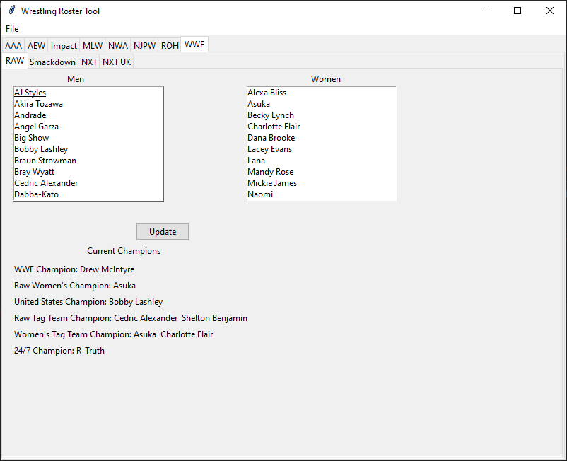

# WrestlingRosterTool
Python application that displays rosters and champions of professional wrestling promotions using web scraping. Data is scraped from Wikipeida.org. 
Application allows saving the rosters to a csv file and will load the csv file the next time the application is ran.

## Requirements
- Requests
- BeautifulSoup4
